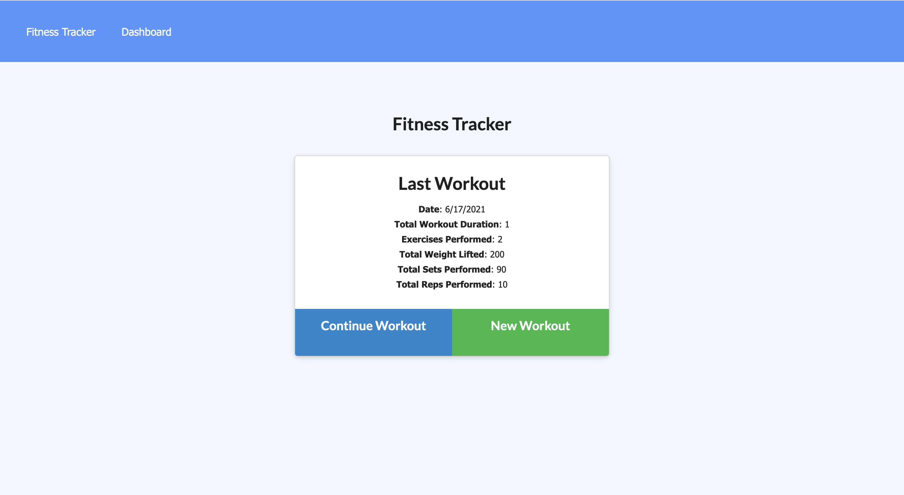
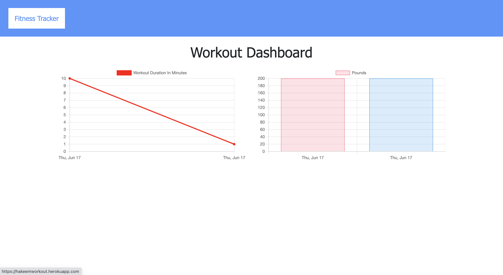
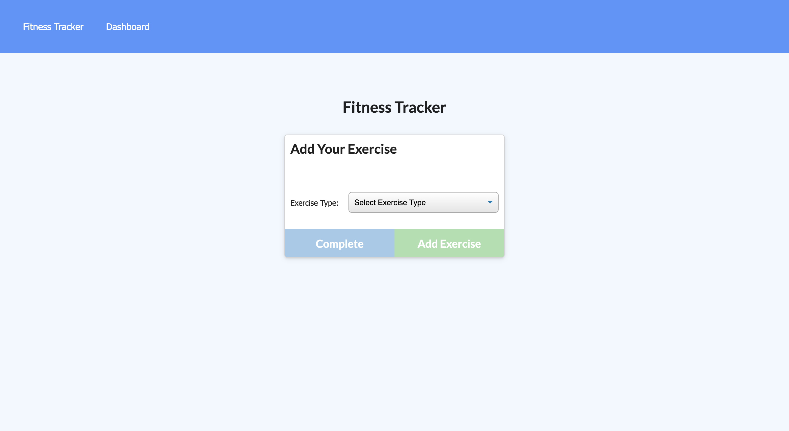
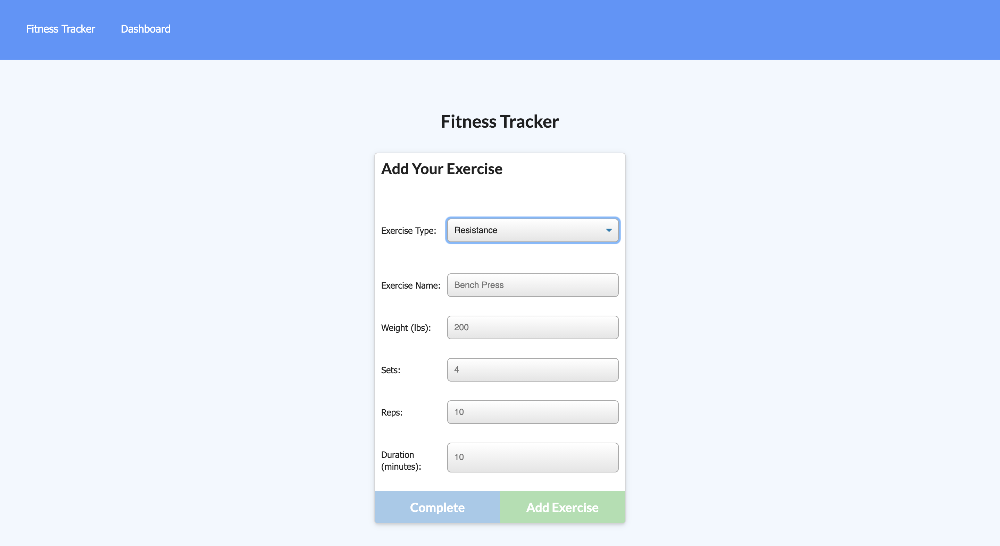
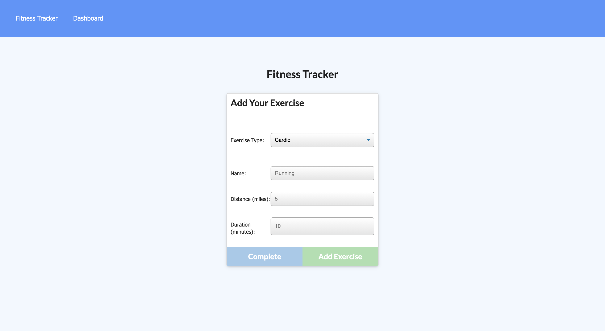

# Workout-Tracker
 

## Table of contents
 * [General info](#General-Info)
 * [Technology](#Technology)
 * [Deployment of application](#Deployment-of-application)
 * [Application Code](#Application-Code)
 * [Screenshots](#Screenshots)

 # General Info

  In Workout Tracker application users allowed to create, view and truck there workouts 

  # Technology used 
  In this appliction we used HTML5 CSS Javascript Node.js Express.js mongoose Mongo Atls

 # Deployment of application

   To run a project, please follow the link 

   [Heroku App Link](https://hakeemworkout.herokuapp.com/)

 # Application Code

   To view application code, please follow the link 

   [Github link](https://github.com/hakeem235/Workout-Tracker)

 # Screenshots

  ### Workout-Tracker Homepage 
   

   ### Dashboard page
   

   ### Select Workout 
   

  ### Resistance Workout
   

   ### Cardio Workout 
   
